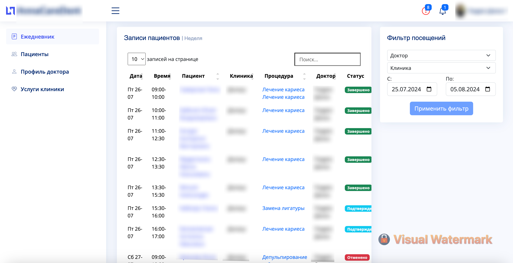
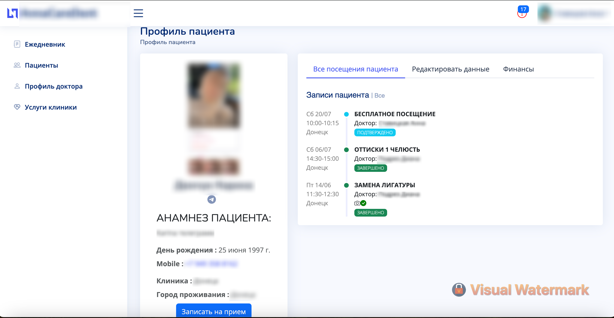

# ANNAMEDICAL
AnnaMedical CRM is a patient relationship management system designed specifically for dental clinics. The project is designed to record patients, maintain medical records and manage appointments. The main part of the project is implemented using Django and Django Rest Framework (DRF), which provides the ability to update data without reloading the page using Ajax requests.

## Contents
- [Project structure](#project-structure)
- [Technologies](#technologies)
- [Main functions](#main-functions)
- [Security](#security)
- [Project team](#project-team)

## Project structure
The project is divided into four main applications:
- core - Main application logic
- appointment - Managing patient appointments
- users - Managing users and their data
- api - Logic for working with the API

## Technologies
- Django
- Django Rest Framework (DRF)
- JavaScript
- HTML
- CSS
- Bootstrap
- PostgreSQL

## Main functions
- Patient accounting and medical records.
- Managing appointments.
- Secure storage and processing of personal data.
- Delimitation of doctors' access to patients of their clinics.
- API for creating, editing and filtering data on patients and appointments without reloading the page.
- Updating data on the page via Ajax requests.

### Security
Special attention is paid to the issues of personal data security and access control. Doctors' access is limited only to patients of their clinics.

## Project team

- [Evgeny Stavitsky](https://t.me/Eugenius71991) — Python Developer

## Sources
I got the information from documentation and open sources.

## Conclusion
I put my heart and soul into it!!!